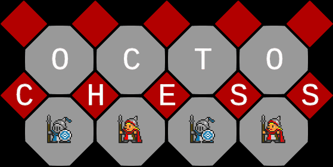

  
___By AntonMakesGames___  

A Checker style game based on an atypical grid.  
This game feature a solo mode as well as a 1v1.  
Art by [OryxDesignLab](www.oryxdesignlab.com)

Coded in Rust using [ggez](https://ggez.rs/)  
[source code](https://github.com/Redoxee/OctogonalChecker)